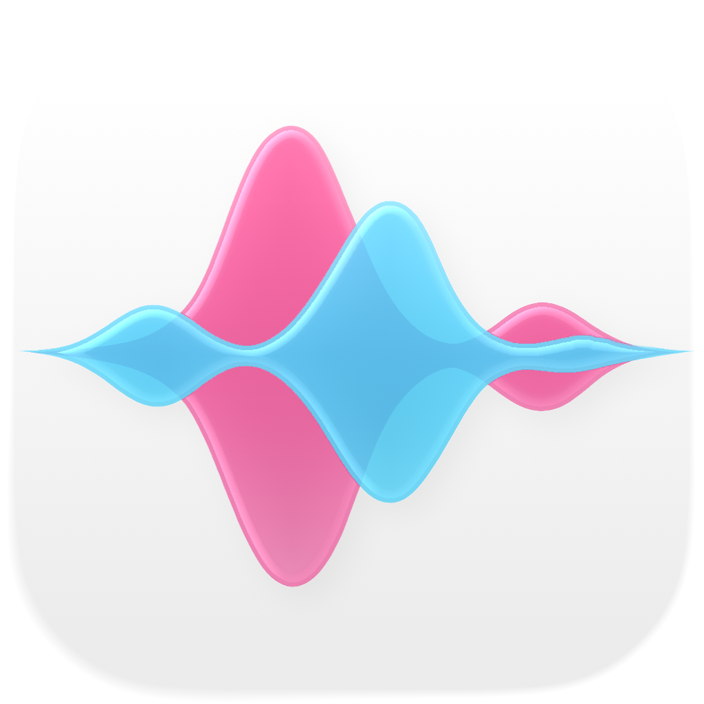

# Voiceform

> Public Showcase

Language: [English](README.md) | [繁體中文](README.zh-TW.md) | **简体中文**

  

Voiceform 是一款以 iPhone 为核心、在设备端运行的声音镜子，聚焦于 pitch、resonance、thinness 与 voice exploration 的实时反馈。

它提供平静、支持性的 iPhone 体验，帮助用户探索更贴近自己的声音。

## App Store Connect

供 TestFlight 与 App Store 审核使用：

- [Voiceform Privacy Policy](privacy.md)
- [Voiceform Support](support.md)

## 概览

- iPhone 端设备内声音练习体验
- 实时反馈覆盖 pitch、resonance、thinness 与 articulation surfaces
- 以 local-first 为核心的私人声音探索
- 此公开展示仓库不包含产品源码或内部实现细节

## 当前状态

| 项目 | 状态 |
|---|---|
| iPhone app | 持续开发中 |
| TestFlight | 内部 beta |
| Android | 规划中 |

## 产品方向

Voiceform 应该感觉支持而非审判，精准但不临床化，具有表达感但仍保持技术可信度。

核心循环很简单：说话、看见实时反馈、调整，并在觉得有帮助时再试一次。

## 贡献者

  
  

| 贡献者 | 角色 | 联系方式 |
|---|---|---|
| [Xana](https://github.com/Xanaxxxxxx) | Lead Developer, HCI & iOS Engineering | `gliding_corers0h@icloud.com` |
| [Jeff](https://github.com/antarfrica) | Research Lead, ML Systems & Voice Science | [GitHub](https://github.com/antarfrica) |
